# T1A3

## references

https://superuser.com/questions/1547228/how-to-activate-python-virtualenv-through-shell-script  
https://stackoverflow.com/questions/16010869/plot-a-bar-using-matplotlib-using-a-dictionary  
https://python-graph-gallery.com/  
https://peps.python.org/pep-0008/   

## Link to repo

https://github.com/ramsumble/T1A3  

## Link to presentation 

https://www.youtube.com/watch?v=7qC6kXgqhTs

## Coding style

### PEP 8 (mostly)
I tied to stick to PEP8 throughout my program sticking to the following conventions:
- Indentation: Use 4 spaces per indentation level 
- Place all import statements at the beginning of the file, each on a separate line.
- Use lowercase letters and underscores for functions and variables
- Use whitespace to improve code readability.

Some parts where I was lacking with PEP 8 would be with:
- Use explicit exception handling instead of a bare except statement.
- Line length: Limit lines to a maximum of 79 characters to ensure readability. 

## List of Features 

### 1. calculating data from a CSV

- calculate_from_csv makes use of a few import statements to carry out its job.
    - import os
        - used for the filepath
    - import csv
        - provides us the capability to read/write to csv's
    - import statistics 
        - a cleaner way to perform statistical calculations
- The data it calculates is stored in a variable that is in the global scope
- The conditional control it has is in the form of an "if" statement which will calculate all data that doesnt contain "null"
- The error handling that is performed will print if there is a non numeric value in row 2
- the output is stored into two variables for mean/std 

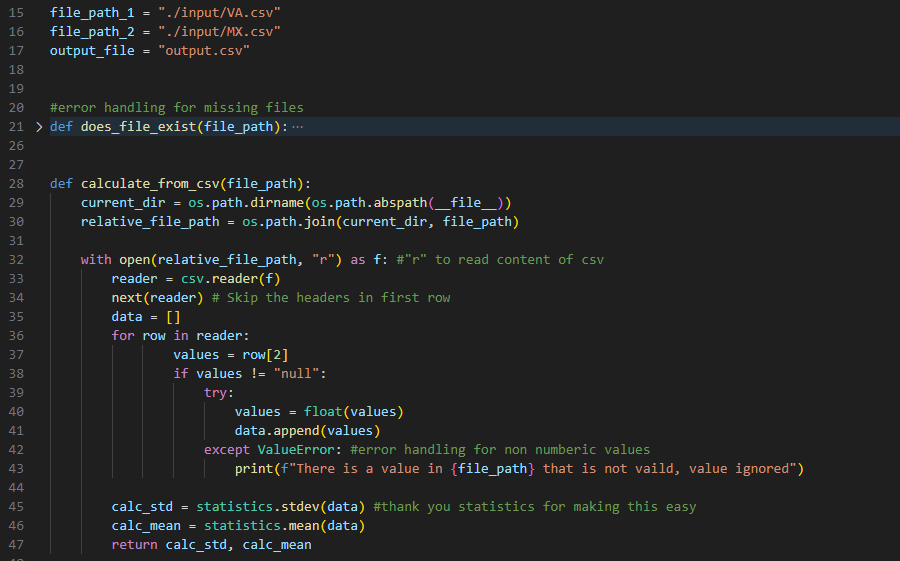
---

### 2. read_csv / group_up_numbers

- read_csv utilizes import csv for... reading the csv
- it uses the same error handling as the previous function, ignore null values and print when a non-numeric character is detected. 
- the data that is read is a variable in the global scope
- its output is a list stored into a variable that will be used by group_up_numbers

The purpose of the group_up_numbers is exacylt as it sounds, to group each number into its corresponding group/value. I figured a Dictionary would make the most sense. (i tried to be lazy and not have to list Keys 0-9, spoiler I had to anyway :(  )
- it uses the variable from read_csv
- we give it an empty dict for the data to be sorted into
- the numbers are iterated over and sorted into their respective groups
- we implemented a counter for numbers < 10 which will also append to their respective group
- the output will be stored to a variable which is to be used by the next function.

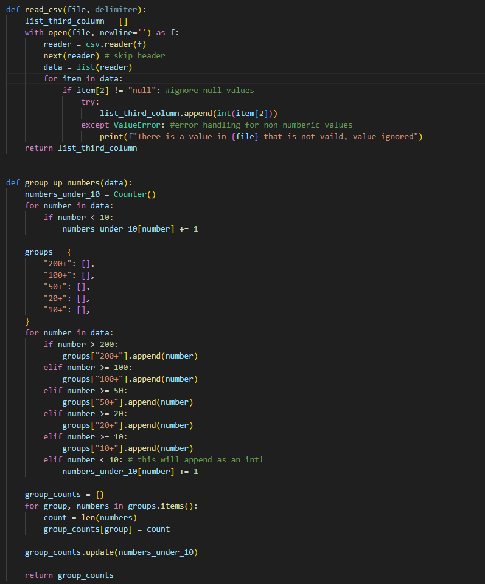
---

### 3. combined_data / graphs

- Combine_data_into_dict purpose is as it sounds, we combine both of the dictionaries from the previous function.
    - we set the key-values for the dictionary
    - iterate over the items in the previous dict and add them to the relevant value based on its index
    - error handling is done upstream by read_csv, not sure what type of errors that could have been implemented for function.

- graphs! 
    - disclaimer: when running the program in a venv the plt.show will not display the graph, for the sake of the assignment the plots will be saved in src.
    - the data from combine_data function is used for the graphs. 
        - 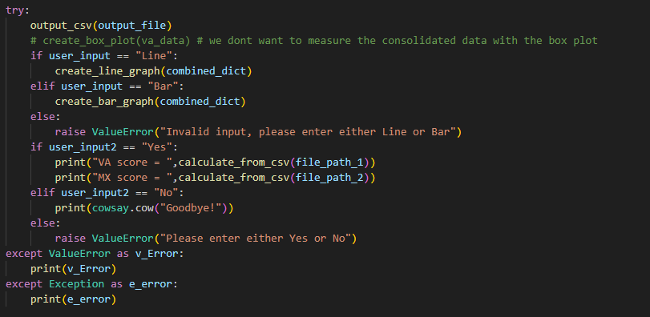  
        - if our user wants to display either Line or Bar graph (for the sake of the venv it will also save) or if an invalid input is entered an error will be raised 
    the following imports are used by the graphs:
    - import seaborn
        - seaborn is used purely for styling, which makes the graphs easier to read
    - import matplotlib.pyplot 
        - used to generate the graphs
    - import numpy 
        - I used numpy to return an array of integers to be used in the graph
    - the graphs will use the values from the combined dicts using their index to know which group is which.
    

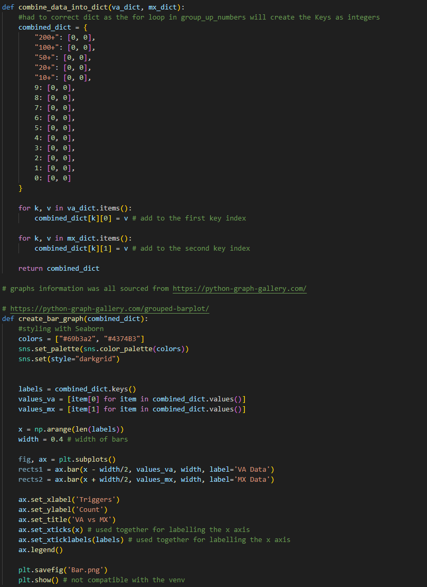
---

## implementation plan 

The implementation plan was done via Trello.
- There wasn't much of a plan on "how" to implement a given function but moreso an order and priority given on implementing functions with a deadline attached.
- the cards were grouped into 3 categories.
    - To Do 
    - fixed
    - Done
- The only notable mention from the categories would be fixes, rather than having too much clutter in the done section I figured giving another classification for correcting issues made sense.
- "core" functions were done as a higher priority as they were fundamental to the project 
- "extras" ranged from niche goofy things like implementing cowsay when interacting with user input to additional graphs, these were lower on the priority list.
- "bug fix" or literally me just forgetting things varied on the priority list depending on how if affected the program.
Some of the "bigger" cards/functions had a checklist which helped stay on track 
- 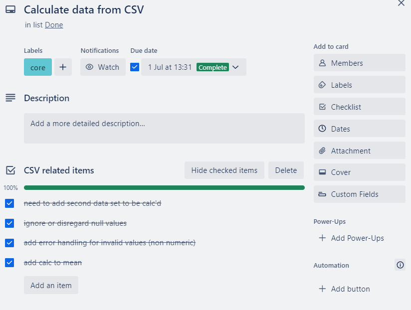

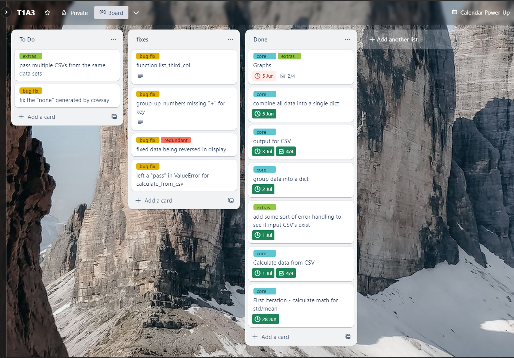

--- 

## Help documentation

To program was developed and tested in a linux environment. 

1. open your terminal of choice
2. navigate to a suitable directory 
3. git clone https://github.com/ramsumble/T1A3.git
4. cd T1A3/src/
5. choose if you want to launch in a venv or not
    - to launch in a venv:
        - source ./script.sh
    - without a venv:
        - ./script.sh

The above script.sh will check to see if you have python3 and pip installed, if not it will do so. Next it will install the dependencies required to run the program. you can find these depenencies in the requirements.txt file.  
**DISCLAIMER**: if you are running in venv the graph display will not work, instead the graph will be saved in src directory.

After the dependencies are installed you are prompted with some inputs:
- to display the graph of your choice enter either:
    - Line
    - Bar
    -  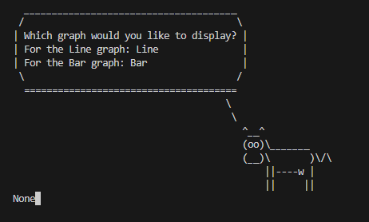
- next you will need to enter if you want to have the "score" of your data displayed in terminal
    - Yes
    - No
    - 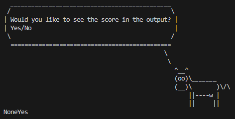
- Our friend will then show us what we have selected.
    - 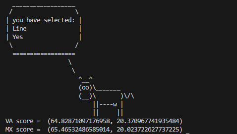 
    - two new files will be created 
        - 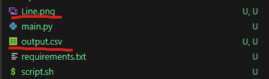
        - 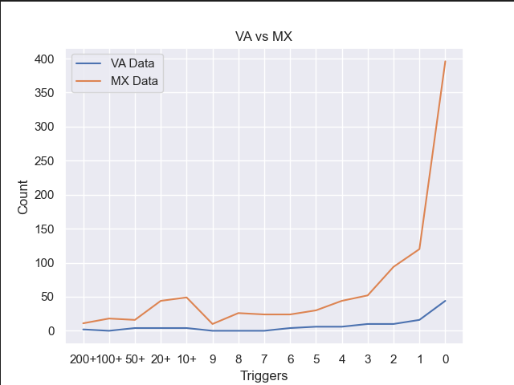
        - 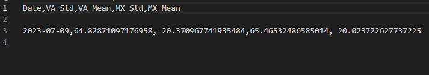 

if you would like to re-run the program:
- python3 main.py